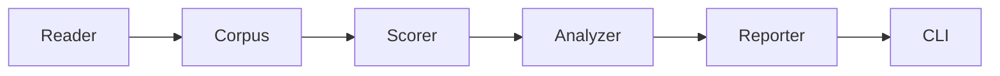

<div align="center">
  <!-- Replace with actual logo if available -->
  <h1>🔍 prompt-architect-analyst</h1>
  <p><strong>Decode how you build with AI. A privacy-first fluency analyzer for OpenCode.</strong></p>

  [](https://github.com/carlosindriago/prompt-architect-analyst/actions/workflows/ci.yml)
  [](https://www.python.org/downloads/)
  [](LICENSE)
  [](https://docs.astral.sh/ruff/)
  [](#internationalization-i18n)
</div>

---

## 📖 Elevator Pitch

**prompt-architect-analyst** is a deterministic, offline-first analyzer for your [OpenCode](https://opencode.ai) interactions. 

Instead of just telling you *how much* you use AI, it reveals **how effectively** you use it. It reads your local SQLite session database in **read-only mode** and generates an interactive, 3D-animated HTML report scoring you across a **5-Dimension Fluency Framework**. 

Identify security leaks, learn to structure prompts like a Senior Architect, and stop treating LLMs like chatbots.

---

## ✨ Key Features

- 🔒 **Privacy-First (100% Local)**: Reads your database locally (`?mode=ro`). No code, paths, or secrets ever leave your machine unless you explicitly opt-in to the LLM-enriched analysis.
- 📐 **5-Dimension Scoring Engine**:
  - **Direction**: Clarity of goals.
  - **Context**: Completeness of background info.
  - **Iteration**: Logical flow of refinements.
  - **Toolcraft**: Effective use of autonomous tools.
  - **Verification**: Post-generation testing and validation.
- 🎨 **Gorgeous Interactive Reports**: Outputs a self-contained, dark-mode HTML dashboard powered by Three.js background animations.
- 💡 **Ideal Prompt Engineering**: Breaks down your interactions and reverse-engineers the "Ideal Prompt" tailored specifically to your coding style.
- 🌍 **Internationalization (i18n)**: Fully translated CLI and HTML reports in English (en), Spanish (es), and Portuguese (pt).

---

## 📸 Screenshots

*(Replace these placeholders with actual screenshots of your interactive report)*

| Dashboard Overview | Ideal Prompt Breakdown | Security Assessment |
|:---:|:---:|:---:|
| `` | `` | `` |

---

## 🚀 Installation

### Using pip (Recommended)
```bash
pip install prompt-architect-analyst
```

### For Development
```bash
git clone https://github.com/carlosindriago/prompt-architect-analyst.git
cd prompt-architect-analyst
python3.12 -m venv .venv
source .venv/bin/activate
pip install -e ".[dev]"
```
*(The `[dev]` extra installs `pytest`, `ruff`, `mypy`, and `bandit`)*

---

## 🛠️ Quickstart

The CLI can be launched with a single command:

### 1. Heuristic-Only Report (Offline, No API Key)
Generates a report using deterministic scoring for Direction, Toolcraft, and Verification.
```bash
prompt-architect-analyst analyze ~/.local/share/opencode/opencode.db \
    --output mi_reporte.html
```

### 2. Full LLM-Enriched Report (Recommended)
Enables Context and Iteration scoring, plus the "Ideal Prompt" breakdown and deep security analysis.
```bash
export OPENAI_API_KEY="sk-..."
prompt-architect-analyst analyze ~/.local/share/opencode/opencode.db \
    --model gpt-4o-mini \
    --output mi_reporte.html
```

### 3. Interactive Menu
Just type the command without arguments to enter the interactive CLI setup!
```bash
prompt-architect-analyst
```

---

## 🌍 Internationalization (i18n)

**prompt-architect-analyst** speaks your language. The CLI auto-detects your system locale on the first run, but you can explicitly change it at any time via the Interactive Menu.

Supported languages for both the CLI prompts and the final HTML report:
- 🇺🇸 English (`en`)
- 🇪🇸 Spanish (`es`)
- 🇧🇷 Portuguese (`pt`)

---

## 🏗️ Architecture: An Immutable 7-Phase Pipeline

The codebase is engineered with strict functional programming principles. Each phase receives immutable inputs and produces immutable outputs (`@dataclass(frozen=True)`). **Nothing is mutated in place.**



| Phase | Module | Responsibility |
|---|---|---|
| **1. Config** | `src/config.py` | Local persistent state and i18n preferences. |
| **2. Reader** | `src/reader/opencode.py` | Connects to `opencode.db` purely in `?mode=ro`. |
| **3. Corpus** | `src/corpus.py` | Aggregates interactions into immutable `Turn` and `Session` entities. |
| **4. Scorer** | `src/scorer.py` | Fast, deterministic heuristic scoring (3 dimensions). |
| **5. Analyzer** | `src/analyzer.py` | Multi-pass LLM pipeline for semantic analysis & Ideal Prompt generation. |
| **6. Reporter**| `src/reporter.py` | Renders the interactive Jinja2 HTML Dashboard. |
| **7. CLI** | `src/cli.py` | Interactive Typer entry point. |

---

## 🛡️ Security & Privacy Guarantees

We take your code's privacy seriously:
- **Zero Writes**: The source database is opened using SQLite `?mode=ro`. It is physically impossible for this tool to alter your OpenCode history.
- **Log Scrubbing**: API keys, paths, and tracebacks are scrubbed automatically via `SensitiveDataFilter`.
- **Permission Guard**: The generated HTML report is written with strict `0o600` permissions (only readable by your user).
- **De-identified AI payloads**: If you opt-in to LLM enrichment, the payload sent to the model contains no actual file contents, no file paths with your username, and no credentials.

---

## 🤝 Contributing

We hold strict engineering invariants (TDD, Zero `Any` in Mypy, and Immutability by Default). 

Please see the [CONTRIBUTING.md](CONTRIBUTING.md) guide before opening a Pull Request.

### Pre-PR Checklist:
```bash
ruff format .          # Auto-format
ruff check .           # Linting & Security (Bandit)
mypy src/ tests/       # Strict type checks
pytest                 # Ensure all 170+ tests pass
```

---

## 📄 License

[MIT License](LICENSE) © Carlos Indriago.

## 🙏 Acknowledgements

The five-dimension scoring engine and AI Fluency framework are heavily inspired by [`claude-insight`](https://github.com/Feloguarin/claude-insight). The SQLite Reader, multi-pass Analyzer, the granular "Ideal Prompt" breakdown, and the interactive Three.js reporting are original contributions of this project.
